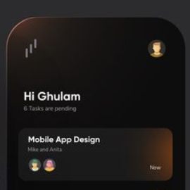
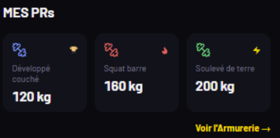

A corriger ! 

- ✅ DONE (25/05/2026) : Dans l'onboarding puis dans les parametres, l'utilisateur doit avoir un moyen de modifier son poids et sa taille et son age et son taux de masse grasse estimée. RulerPicker Reanimated implémenté dans edit-profile.tsx. Migrations DB requises (voir ci-dessous).

- A l'ouverture de l'app, on arrive dans le feed. Je veux que la disposition de ce layout soit retravaillé : 
    - Sur la bande en haut de l'ecran je veux pouvoir avoir acces a l'onglet profil avec un icone, Une phrase de bonjour et Avoir le logo de Orava sports.
    - Je veux que juste en dessus de cette bande il y ai une sorte de bandeau design avec deux ou trois chiffres éléments clés sur l'utilsateur (un icone de carte qui permette d'acceder a une carte dsign avec les salles de sport presentes a coté de la localisation de l'utilisateur, Nombre de séances ce mois ci, un chiffre indiquant une tendance globale haussière ou baissière par rapport a son etat d'entraienement)
    our ces deux point tu peux t'inspirer de ce design : 
    - L'affichage de chaque séance du feed doit être retravaillé : je veux quelque chose de visuellement plus propre. L'icone de profil de l'utilisateur de l'activité, la date et leur de sa séance, le titre de sa séance, like et commentaire possibles, le lieux de la seance et la salle (ex basic-fit), trois metriques clés qui sont toujours les memes pour toutes les activités : Volume soulevé, durée de la séance, un score global de séance quon calculera dans un prochain fix, et enfin l'essentiel (quivalent de la carte pour strava) qui est le visuel 2D en grand de Myon accompagné des photos quon put slide. Tu peux si tu veux ecrire un prompt pour figma pour generer le visuel avant de l'implémenter.
    - Quand je clique longtemps sur les icones likes ou comments je dois avoir acces a qui a liké et commenté

- La barre de navigation en bas doit etre grandement simplifiée : 
    - L'onglet historique doit etre dans le layout du profil
    - Garde juste les trois gros onglets feed, log seance et bibliothèque
    
- Dans l'onglet profil :
    - Le visuel doit être comme un portefolio, il sert de page de présentation comme sur un profil instagram. 
    - Les différents menus doivent êtres présents : parametres, Armurerie des PRs, le menu analytics, le nombre de folloxers et de gens suivis, quelues chiffres clés comme il y a déja (attention le nombre de kg du mois doit etre en une seule ligne pas coupé)
    - un graph pour visuliser une tendance generale
    - Une visu tres rapide des chiffrs clés sur les meilleurs PRs doivent se voir (cf cette photo )
    Ecris un prompt pour travailler ce design avec figma

- ✅ DONE (25/05/2026) : Dans la bibliothèque ajoute une catégorie favoris qui s'affiche en premier. AsyncStorage `library_favorites` avec star toggle animé et section "FAVORIS".

- ✅ DONE (25/05/2026) : Pour chaque détail d'exos dans la bibliothèque : 
    - Barre fine sous chaque muscle (hauteur 3px, largeur relative au %, colorée par rôle).
    - Zone placeholder visuel en haut (180px, backgroundColor secondary).

## Migrations DB requises

Avant que les utilisateurs puissent sauvegarder les profils avec les RulerPickers, ajouter les colonnes :

```sql
ALTER TABLE users ADD COLUMN IF NOT EXISTS taille_cm INTEGER NULL;
ALTER TABLE users ADD COLUMN IF NOT EXISTS age INTEGER NULL;
ALTER TABLE users ADD COLUMN IF NOT EXISTS masse_grasse_pct FLOAT NULL;
```

Exécuter dans Supabase Console SQL Editor.

- Dans le feed, quand je clique sur une activité, je veux une interface qui permette de visualiser le Myo en gros et avec menu 3D, les photos ajoutés par l'utilisateur en grand si je clique, le recap de la séance, les commentaires et les likes

- Au moment de démarrer une séance, je veux au dessus d'Orava le logo

- Dans l'interface au moment de faire une séance, je veux réinventer le layout pour qu'il soit efficace mais avec un design plus travaillé et inventif. 
    - Le temps de séance doit etre en haut mais un peu plus centré, on doit voir le logo Orava. 
    - La manière d'ajouter un exo doit être revu pour etre plus design
    - Garde la manière d'ajouter un exercice mais le panneau doit s'ouvrir en entier avec une animation qui bounc un peu moins.
    - Meme systeme de favoris pour ajouter un exo
    - Les animation au moment d'enregistrer une série doit etre retravaillée car c'est ici que l'on doit avoir des petits indicateurs discrets en verts pour le mode fantome ou l'on se compare a sois meme que quand c'est nécessaire. Ca doit etre subtile et discret mais visuellement agrébale.
    - ATTENTION, la roue ne fonctionne pas ! Ce n'est pas fluide quand je la scrolle et les nombres que je selectionne sont masqués. Je veux un autre système ou la roue prend tout l'ecran quand je veux ajouter une serie.
    - Le timer de récup doit s'activer des la validation de la serie avec la roue.
    - L'animation et le layout de rsumé de la séance avant de publier est parafait ! ajoute seulement une animation qui fait défilé le nombre de kg soulevé.


